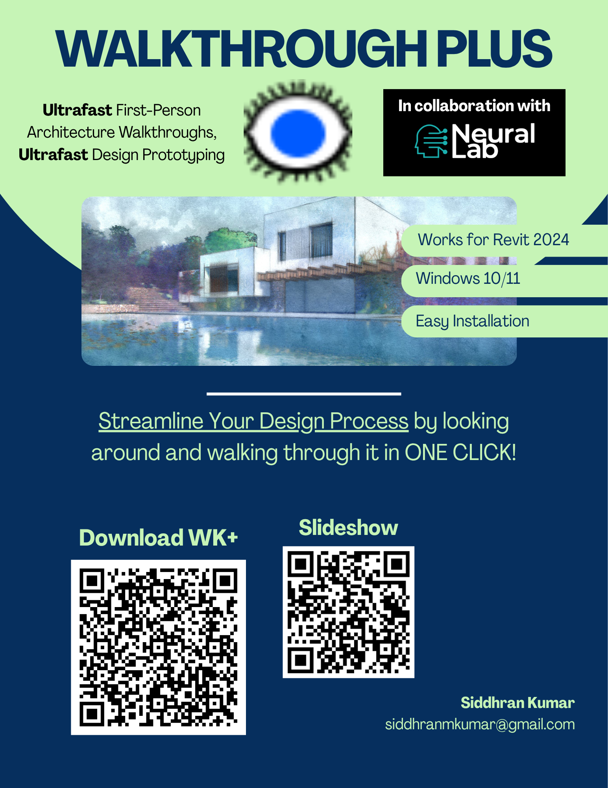

# Walkthough PLUS - Revit Plugin
### Real-Time Design Prototyping for Architects

Walkthrough PLUS is a lightweight bridge for Revit 2024 that allows architects to look at and through their designs from an actual interactive human perspective.

While programs like Lumion are built for final high-end renderings, Walkthrough PLUS is built for the design process. It’s a fast, zero-configuration tool that let's you walk through your project like a pedestrian with the click of a button. 
 
### 💡 Why Walkthrough PLUS? 

Instant Prototyping: Push one button in Revit and be inside your model in seconds.

Unique Visualization: Few, if any, architecture visualization programs actually let you walk through your designs instead of flying through them.

Fluid Interaction: You have the option to use the AirTouch (https://neural-lab.com) gesture system to navigate your model hands-free. it is perfect for presenting to clients or feeling the space without a keyboard in the way.
 
### 🛠 Specifications

Windows 10/11

Autodesk Revit 2024.1 (Other v2024 versions likely to work, NOT TESTED)

Input: Keyboard & Mouse and/or AirTouch Gesture Control (Toggle: K-key)
 
### 📦 How to Use

Install: Run mysetup.exe.

Launch: Open your Revit project and find the Add-In tab.

Walk: Click the button and follow the on-screen instructions.
 
### ⚖️ License
Licensed under the MIT License.
Copyright (c) 2026 featherLITE / Siddhran Kumar

## Questions?

Contact me: siddhranmkumar@gmail.com

# Want more information?

Here is a [slideshow](https://canva.link/5saehpwxk1fq7or) that covers the usefulness of this program.

Here is a flyer as well:

